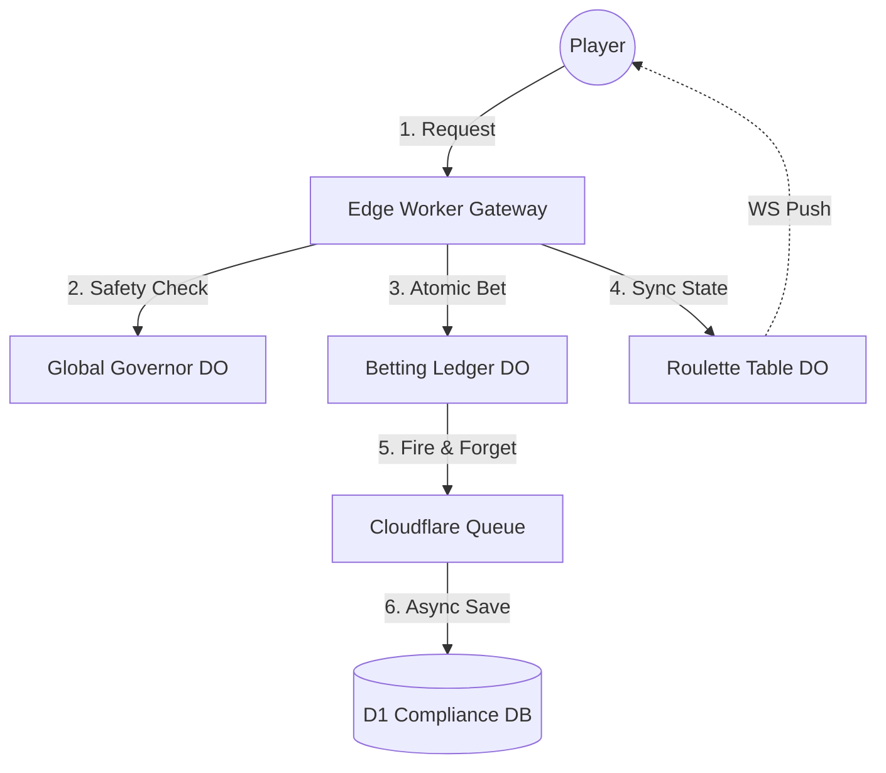

# Cloudflare "iGaming Edge" (cf-casino)

[](https://www.typescriptlang.org/)
[](https://workers.cloudflare.com/)
[](https://vitest.dev/)

A high-performance, atomic, and compliant betting engine built entirely on Cloudflare's Edge-Native stack. This project demonstrates the "Edge Advantage" for the iGaming industry, focusing on zero-cost origin execution, sub-millisecond state transitions, and non-blocking compliance pipelines.

---

## 🎰 The Premise: Why "iGaming Edge"?

Traditional iGaming platforms suffer from three major bottlenecks:

1. **Database Race Conditions:** High-frequency bets often lead to balance inconsistencies.
2. **Latency Jitter:** Centralised origins (AWS/GCP) introduce variable RTT, especially for real-time multiplayer games.
3. **Runaway Infrastructure Costs:** Maintaining massive DB clusters for compliance logs is expensive and slow.

**cf-casino** solves this by moving the entire stack to the **Cloudflare Edge**:

- **Atomic Betting Engine:** Uses **Durable Objects** to guarantee that every bet is processed sequentially and balance changes are atomic.
- **Jurisdictional Sovereignty (UK/EU):** The platform uses location hints to pin PII and betting state to specific Edge regions (e.g., `weur` for UK/EU compliance) while maintaining globally sub-50ms latency.
- **Zero-Cost Origin:** Requests are rejected at the Worker level before ever hitting a DO if they fail validation, or if the bot detection fails, saving substantial compute costs.
- **Async Compliance:** Audit logs are offloaded to **Cloudflare Queues** and persisted to **D1** asynchronously, ensuring the player session is never blocked by database writes.

---

## 🏗️ System Architecture



---

## 🚀 Tech Stack

### Backend (Edge Runtime)

- **Runtime:** [Cloudflare Workers](https://workers.cloudflare.com/) (Service Worker + ES Modules)
- **State Management:** [Durable Objects](https://developers.cloudflare.com/durable-objects/) (Atomic SQLite storage)
- **Database:** [Cloudflare D1](https://developers.cloudflare.com/d1/) (Relational Compliance Storage)
- **Messaging:** [Cloudflare Queues](https://developers.cloudflare.com/queues/) (Non-blocking pipelines)
- **Fast Storage:** [Cloudflare KV](https://developers.cloudflare.com/kv/) (Latency Benchmarking & L1 Config)
- **Observability:** Cloudflare Analytics Engine + Rollbar.

### Frontend

- **Framework:** React 18 + Vite (TypeScript)
- **Styling:** Tailwind CSS + shadcn/ui
- **Icons:** Lucide React

---

## 🛠️ Getting Started

### 1. Prerequisites

- **Cloudflare Account:** A [Workers Paid plan](https://developers.cloudflare.com/workers/platform/pricing/#workers-paid) ($5/mo) is **required** to use Durable Objects.
- **Node.js:** v18+
- **Wrangler CLI:** `npm install -g wrangler`

### 2. Installation

```bash
git clone https://github.com/cloud-commander/cf-casino.git
cd cf-casino
npm install
cd frontend && npm install && cd ..
```

---

## 🚀 Deployment

### Local Development

The backend simulates D1, KV, and Durable Objects locally.

```bash
# Run backend
npm run dev

# Run frontend (in separate terminal)
cd frontend && npm run dev
```

### Production Deployment (Cloudflare Edge)

#### 1. Provision Production Infrastructure

Execute these commands to create your production resources:

```bash
# D1 Compliance Database
npx wrangler d1 create cf-casino-db-at-prod

# KV Namespaces
npx wrangler kv:namespace create cf-casino-lobby-prod
npx wrangler kv:namespace create cf-casino-governor-prod

# Queues (Audit Pipeline)
npx wrangler queues create cf-casino-audit-queue-prod
npx wrangler queues create cf-casino-audit-dlq-prod
```

**CRITICAL:** Copy the generated IDs into the `env.production` section of your `wrangler.jsonc`.

#### 2. Set Production Secrets

Cloudflare Secrets are encrypted and set via CLI:

```bash
npx wrangler secret put JWT_SECRET --env production
npx wrangler secret put ROLLBAR_TOKEN --env production
npx wrangler secret put TURNSTILE_SECRET_KEY --env production
npx wrangler secret put CF_API_TOKEN --env production
```

#### 3. Deploy Backend

```bash
npm run deploy:prod
```

#### 4. Custom Domain Lockdown

The project is configured to only respond to `api.casino.cfdemo.link`. To enable this:

1.  In the Cloudflare Dashboard, go to **Workers & Pages** -> your backend worker.
2.  Go to **Settings** -> **Triggers** -> **Custom Domains**.
3.  Add `api.casino.cfdemo.link`.
4.  Ensure `workers_dev: false` remains set in your `wrangler.jsonc` once your custom domain is active.

#### 5. Deploy Frontend (CLI-First via Wrangler)

The frontend is a Vite application. You can deploy it to **Cloudflare Pages** directly from your terminal:

1.  **Build the application:** This bakes the production variables into your static assets.
    ```bash
    # From the ROOT directory:
    cd frontend
    VITE_API_BASE_URL=https://api.casino.cfdemo.link VITE_TURNSTILE_SITE_KEY=0x4AAAAAACXq8TepTf8S8JIe npm run build
    cd ..
    ```
2.  **Deploy via Wrangler:** This uploads the pre-built `dist` folder.
    ```bash
    npm run deploy:frontend
    ```
    _(If this is the first deployment, it will prompt you to create the `cf-casino-frontend` project.)_

#### 6. Service Specific Setup

**🧩 Bot Protection (Cloudflare Turnstile)**

1.  Go to **Workers & Pages** -> **Turnstile**.
2.  Add a new site (Managed type).
3.  Update the site key and secret key in your environment variables and secrets respectively as instructed above.

**🎙️ Realtime Audio (Cloudflare RealtimeKit)**

1.  Go to **My Profile** -> **API Tokens**.
2.  Create a token with `Realtime: Admin` permissions.
3.  Set this as `CF_API_TOKEN` in your Worker secrets.
4.  Ensure your `ACCOUNT_ID` and `REALTIME_KIT_APP_ID` are set correctly in `wrangler.jsonc` (Default app: `cf-casino`).

---

## 🧪 Testing & Coverage

We maintain a strict **"No-Any"** policy and high test coverage for business logic.

```bash
# Run backend tests with coverage report
npm run test:coverage
```

Current Status:

- **Total Coverage:** 96%
- **Critical Path (Ledger/Governor):** 90%+
- **Pure Logic:** 100%

---

## 🛡️ Cost Safety & Guard Rails

To prevent runway costs during development or DDoS attacks, the project implements a **Global Governor**:

1. **L1 (KV):** Quick status check on every request ($0 cost).
2. **L2 (Durable Object):** Precise monthly/daily cent-based budget tracking.
3. **Hard Ceiling:** Automatically places the entire platform into `LOCKDOWN` mode if thresholds are reached.

---

## 📜 Documentation

Detailed High-Level Design (HLD) is available in the `docs/hld/` directory:

- [03: System Architecture](docs/hld/03_system_architecture.md)
- [04: Atomic Betting Engine](docs/hld/04_component_betting_engine.md)
- [17: Cost Safety Strategy](docs/hld/17_cost_safety.md)

---

## ⚖️ License

Distributed under the ISC License. See `LICENSE` for more information.
